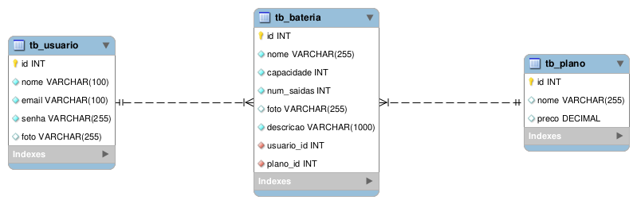

# PowerGreen
**PowerGreen**
*Energia limpa em moviento*
 [](https://github.com/wagnermor/PowerGreen_BackEnd/blob/main/LICENSE) 
# Sobre o projeto

[https://powerGreen.com.br](https://github.com/wagnermor/PowerGreen_BackEnd "Projeto powerGreen")
PowerGreen é uma aplicação full stack, web e mobile, construída como projeto integrador durante o bootcamp **JAVA FullStack** oferecido por [Generation](https://brazil.generation.org "Site da Generation") e [Zé Delivery](https://www.ze.delivery "Site do Zé Delivery").

A aplicação consiste em um e-commerce para locação de bateria recaregável (powerbank) para veículos elétricos, onde é feito o cadastro e login do usuário e depois de logado, são listadas as baterias disponíveis para locação.


## Modelo 


## DER - Diagrama Entidade Relacionamento


# Tecnologias utilizadas
## Back end &nbsp; 

- Java
- Spring Boot
- JPA / Hibernate
- Maven

## Implantação em produção
- Back end: 
- Banco de dados: MySQL

# Como executar o projeto

## Back end
Pré-requisitos: Java 11

```bash
# clonar repositório
git clone https://github.com/wagnermor/PowerGreen_BackEnd

# entrar na pasta do projeto back end
cd powerGreen

# executar o projeto
./mvnw spring-boot:run
```

# Colaboradores
<div>
  <div style = "max-width:140px;
    text-align:center;
    border:none;
    float:left;
    display:inline-block;
    margin: 0 24px 16px 0">
    <div style="border-radius: 100%;
        margin:0 auto;
        overflow: hidden;
        height: 100px;
        width:100px;
        background: black;">
        
    </div>
    <p>Wagner Moreira</p>
    <a href="https://github.com/wagnermor" target="_blank">
      
    </a>
  </div>

<div style = "max-width:140px;
    text-align:center;
    border:none;
    float:left;
    display:inline-block;
    margin: 0 24px 16px 0">
    <div style="border-radius: 100%;
        margin:0 auto;
        overflow: hidden;
        height: 100px;
        width:100px;
        background: black;">
        
    </div>
    <p>Marlon Bassoto</p>
    <a href="https://github.com/Killbazz" target="_blank">
      
    </a>
  </div>

<div style = "width:140px;
    text-align:center;
    border:none;
    float:left;
    display:inline-block;
    margin: 0 24px 16px 0">
    <div style="border-radius: 100%;
        margin:0 auto;
        overflow: hidden;
        height: 100px;
        width:100px;
        background: black;">
        
    </div>
    <p>Joel Jr.</p>
    <a href="https://github.com/Joeljrbeginner" target="_blank">
      
    </a>
  </div>

<div style = "width:140px;
    text-align:center;
    border:none;
    float:left;
    display:inline-block;
    margin: 0 24px 16px 0">
    <div style="border-radius: 100%;
        margin:0 auto;
        overflow: hidden;
        height: 100px;
        width:100px;
        background: black;">
        
    </div>
    <p>Carol Bertulli</p>
    <a href="https://github.com/CarolBertulli" target="_blank">
      
    </a>
  </div>
  
  <div style = "width:140px;
    text-align:center;
    border:none;
    float:left;
    display:inline-block;
    margin: 0 24px 16px 0">
    <div style="border-radius: 100%;
        margin:0 auto;
        overflow: hidden;
        height: 100px;
        width:100px;
        background: black;">
        
    </div>
    <p>Jessica Cavalcante</p>
    <a href="https://github.com/jess59cavalcante" target="_blank">
      
    </a>
  </div>

<div style = "width:140px;
    text-align:center;
    border:none;
    float:left;
    display:inline-block;
    margin: 0 24px 16px 0">
    <div style="border-radius: 100%;
        margin:0 auto;
        overflow: hidden;
        height: 100px;
        width:100px;
        background: black;">
        
    </div>
    <p>Gustavo Henrique</p>
    <a href="https://github.com/Jotapppe" target="_blank">
      
    </a>
  </div>

  <div style = "width:140px;
    text-align:center;
    border:none;
    float:left;
    display:inline-block;
    margin: 0 24px 16px 0">
    <div style="border-radius: 100%;
        margin:0 auto;
        overflow: hidden;
        height: 100px;
        width:100px;
        background: black;">
        
    </div>
    <p>Henrique Vieira</p>
    <a href="https://github.com/wagnermor" target="_blank">
      
    </a>
  </div>
</div>
